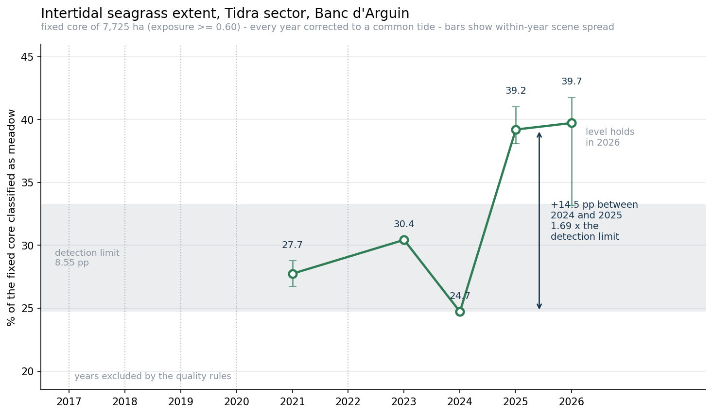
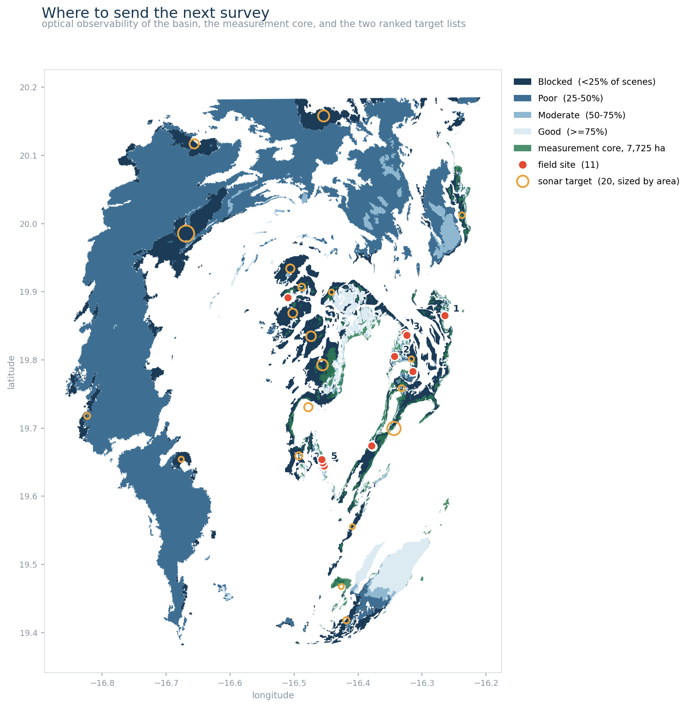
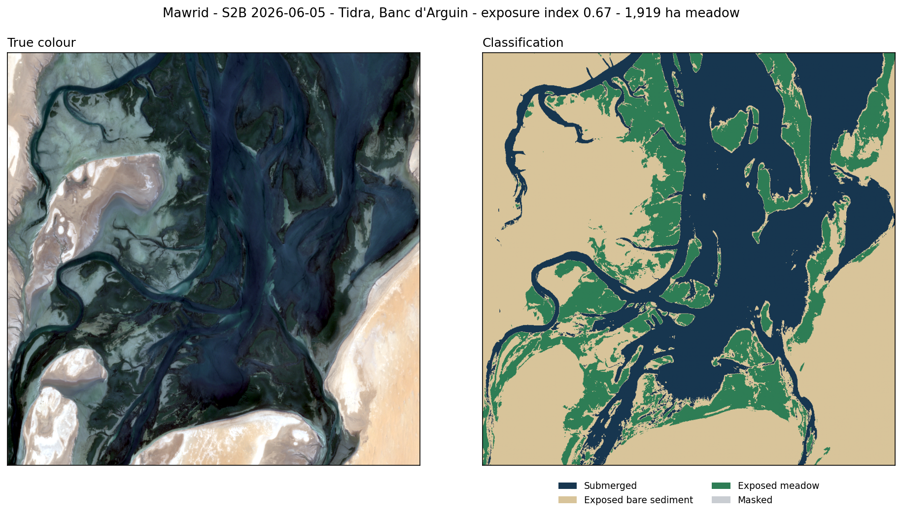

# Mawrid — coastal water intelligence for the Banc d'Arguin

**Team:** Malakout (ملكوت) · **Country:** Mauritania
**Theme:** Water Quality & Inland/Coastal Water Intelligence
**Event:** Arab Youth Space Hackathon 2026 — 813 Challenge, Proof of Concept

Mawrid turns the Sentinel-2 archive into a coastal water intelligence layer for
the Banc d'Arguin: where the water is clear enough to monitor from orbit, how
the seagrass meadows of the intertidal flats have changed year on year, and
where a boat has to go because the satellite cannot see.



---

## 1. What this is

A measurement system, not a map. It answers one question — *has the seagrass of
the Tidra flats changed, and by how much?* — and it answers it with an error bar
that was measured rather than assumed.

The headline result: within a fixed 7,725 ha core of the intertidal zone, the
share classified as seagrass meadow rose **15.0 percentage points between 2024
and 2026**, which is **1.75 times the measured detection limit of 8.55 pp**.
That makes it a likely trend. It does not make it a proven one, and this
repository is explicit about the difference.

## 2. The business use case

**The user** is the management authority of the Parc National du Banc d'Arguin,
and the research institutes and NGOs that advise it.

**The decision they make** is where to send a survey team. Field capacity in the
park is a handful of boat days per season across 12,000 km² of shallows. Today
that allocation is made from expert judgement and from campaigns that are years
apart, because there is no basin-wide layer that says where something has
changed.

**What Mawrid gives them** is three products, in the order they are used:

| Product | Answers |
|---|---|
| `results/series_trend.png`, `results/series.json` | Has the meadow changed, by how much, and is that above the noise? |
| `results/observability.*` | Which parts of the basin can a satellite measure at all? |
| `results/priority_field.geojson`, `results/priority_sonar.geojson` | Given a fixed survey budget, where should the next boat go? |

The last of these is the one with commercial weight. 11 ranked field sites and
20 sonar targets, each with coordinates and a stated reason, replace a season of
guessing with a route.

## 3. The problem, and why a satellite

The Banc d'Arguin holds one of the largest intertidal seagrass systems on the
Atlantic coast of Africa. The meadows stabilise the sediment, feed the nursery
that the national fishery depends on, and support over two million migratory
shorebirds. Seagrass systems elsewhere have collapsed in years rather than
decades, and marine heatwaves have driven losses of comparable meadows in
Europe.

Nobody can say whether this one is losing ground, because nobody is measuring
it continuously. Field campaigns cover a few transects every few years.

Sentinel-2 is the right instrument for one specific reason: at low water a
large part of these meadows is **out of the water entirely**. The turbidity that
defeats optical remote sensing in this basin — and it does, see section 9 — does
not apply to a meadow standing in air. Twice a day the system hands the
satellite a clear view of its own intertidal zone, free, every five days,
since 2017.

## 4. Data used

| Dataset | Detail |
|---|---|
| Product | Sentinel-2 Level-2A surface reflectance (COG) |
| Provider | ESA Copernicus, via the Element 84 Earth Search STAC API (`sentinel-2-l2a`) |
| Bands | B02 blue, B03 green, B04 red, B08 NIR, SCL scene classification |
| Period | 2017-01-01 to 2026-06-30, 72 scenes passing the cloud filter |
| Resolution | 10 m, reprojected to EPSG:32628 |
| Licence | Copernicus open and free data, no registration required |
| Area of interest | Tidra sector, Banc d'Arguin, Mauritania — footprint in `docs/grid_extent.geojson` |

No Level-2A reflectance offset is applied. Every measurement in this pipeline is
relative to a stable bare-sediment target in the same scene, so the offset
cancels; applying it inconsistently across an archive that spans the processing
baseline change would do more harm than leaving it out. This is stated here
because it is the kind of choice a reviewer should be able to check.

The committed sample in `data/sample_input/` is a 1024 × 1024 pixel window of
one public scene (S2B, 2026-06-05). `src/fetch_scene.py` re-cuts it from the
archive if you want to verify that.

## 5. Technical approach

In execution order:

1. **Scene selection.** 126 candidate passes scanned; keep scenes with under 30%
   cloud over the area of interest, then apply three quality rules fixed in
   advance — core coverage ≥ 75%, sensor noise floor ≤ 10%, and tidal exposure
   within ±0.05 of the reference. 72 scenes survive to the observability layer,
   and one scene per year to the series.
2. **Masking.** Reject SCL codes 0, 1, 3, 8, 9, 10, 11 (no-data, saturated,
   cloud shadow, cloud, cirrus, snow) per pixel.
3. **Land–water split.** Water absorbs in the near infrared, so NIR > green
   means the pixel is exposed. The fraction of valid pixels that are exposed is
   the scene's **exposure index**: a direct measure of the tide at acquisition.
4. **The measurement arena.** A fixed core of 7,725 ha, defined once as the
   pixels exposed in at least 60% of scenes. Every year is measured inside the
   same polygon, so the denominator never moves.
5. **Classification.** Within the exposed area, NDVI > 0.3155 is meadow. The
   threshold came from Otsu's method on the reference scene, applied once and
   then frozen for all years.
6. **Sensor normalisation and a dust detector.** A stable bare-sediment target
   is classified in every scene. The share of it falsely called meadow is the
   **noise floor**; it catches sensor offsets and Saharan dust. Two years were
   dropped on this test alone.
7. **Tide correction.** Repeat scenes *within* the same year give the slope of
   measured extent against exposure index: **−81.4 pp per unit**. Each year is
   corrected onto a common reference tide with it. The slope is estimated
   without reference to any between-year difference, so it cannot manufacture
   the trend it is used to test.
8. **Detection limit.** Repeat scenes within one year measure the same unchanged
   meadow. They disagree by **8.55 pp**. That is the measured noise of the
   method, and nothing smaller than it is reported as a change.
9. **Observability.** Across all 72 scenes, the fraction in which the sea bed
   was optically visible, per 60 m cell.
10. **Priorities.** Classification uncertainty × change magnitude × observability
    → ranked field sites; low observability × large area → sonar targets.





## 6. Installation

Requires Python 3.11.

```bash
git clone https://github.com/El-Arby571/mawrid.git
cd mawrid
python -m venv .venv && source .venv/bin/activate
pip install -r requirements.txt
```

On Windows, activate with `.venv\Scripts\activate` instead.

No credentials, API keys or environment variables are needed. The notebook runs
entirely offline on the committed sample.

## 7. How to run

```bash
jupyter lab notebooks/02_main_analysis.ipynb
```

Run all cells. Nothing needs editing. Runtime is under a minute on a standard
laptop, no GPU. It reads `data/sample_input/example_scene.tif` and the files in
`results/`, and rewrites `results/example_output.png` and
`results/series_trend.png`.

At the end you will have reproduced the classification on the sample scene
(exposure index 0.672, 1,919 ha of meadow), both figures, the full series table
with the reason each missing year was excluded, the observability breakdown, and
the top of the two priority lists.

To re-download the sample scene from the public archive:

```bash
python src/fetch_scene.py
```

## 8. Example input and output

**Input** — `data/sample_input/example_scene.tif`, 5 bands, 1024 × 1024 at 10 m,
EPSG:32628, with `example_scene.json` recording the exact scene, date and window.

**Output** — everything in `results/`:

| File | What it is |
|---|---|
| `series_trend.png` | The headline figure, above |
| `example_output.png` | True colour and classification of the sample scene |
| `series.json` | The corrected series, detection limit, tide slope, and the numeric reason each missing year was excluded |
| `scenes.json` | Every candidate scene with its exposure, noise, coverage and accept/reject flag |
| `core.geojson` | The fixed 7,725 ha measurement core |
| `meadow_<year>.geojson` | Classified meadow for each usable year |
| `observability.json`, `observability.geojson`, `observability_preview.png` | Where the satellite can see the bottom |
| `priority_field.geojson` | 11 ranked field-visit sites |
| `priority_sonar.geojson` | 20 sonar targets in the blind areas |
| `priority_map.png` | The two target lists drawn over the observability layer and the core |

## 9. Results and limitations

**Measured.** Share of the fixed core classified as exposed meadow, corrected to
a common tide: 2021 — 27.74, 2023 — 30.43, 2024 — 24.72, 2025 — 39.20,
2026 — 39.72 (percentage points). The 2024→2026 rise of 15.0 pp is 1.75× the
detection limit.

**Validated by.** A detection limit measured from repeat scenes where the true
change is zero; a tide slope estimated within years; a stable bare-sediment
target normalising sensors and flagging dust.

**Limits, stated plainly.**

- **Only 6.3% of the submerged area is reliably observable from orbit.** 24.7%
  is effectively blind, with the bottom visible in under a quarter of scenes.
  Everything reported here concerns the intertidal core. The deep meadows are
  beyond this method, which is exactly why the sonar list exists.
- **Five of ten years are missing** — 2017, 2018, 2019, 2020, 2022 — each for a
  stated numeric reason. The series is five points, not a continuous record.
- **No field validation.** Nothing here has been checked against a transect. The
  result is a likely trend, not a proven one.
- **A submerged-meadow branch was built and withdrawn.** Under the turbidity of
  this basin the blue and green bands do not carry a usable bottom signal often
  enough. The observability layer is what replaced it, and it is the more honest
  product.
- **An earlier version of this work claimed a loss between two dates. That claim
  was retracted** after a tide-sensitivity test showed the two dates were taken
  at different tides, and the apparent change was within what the tide alone
  explains. The method in this repository exists because of that failure.
- **Hyperspectral data would help, but not with turbidity.** Narrower bands
  would separate seagrass from green algae and from wet sediment, which is a
  real limit of a single NDVI threshold. No band recovers a bottom signal that
  never reached the sensor.

**Next, with incubation support.** Field validation against transects on the 11
ranked sites; acoustic survey of the largest blind areas; extension from the
Tidra sector to the full park; and hyperspectral bands for species separation
once a usable revisit exists over this coast.

## 10. Team, licence and attribution

Team **Malakout (ملكوت)**, Mauritania — four members, all registered on the
hackathon platform:

| Member | Role |
|---|---|
| Zhr El-Arby (`24271@supnum.mr`) | Team leader — pipeline, analysis, repository |
| `banocamara2006.hc@gmail.com` | Team member |
| `nahecheikhsidiya@gmail.com` | Team member |
| `Khadijasnabdellahi@gmail.com` | Team member |

The presentation submitted with this proof of concept is `docs/slides.pdf`.

Code is released under the MIT licence, see `LICENSE`.

Built on Copernicus Sentinel-2 data (ESA), accessed through the Element 84
Earth Search STAC API, and on rasterio, NumPy, SciPy, Shapely and Matplotlib.

The tidal-exposure problem, the limits of optical remote sensing in this basin,
and the existence of a 2018 Landsat baseline were pointed out to us by
Dr. El-Hacen M. El-Hacen (University of Nouakchott / University of Groningen),
whose critique caused the retraction described in section 9. The analysis,
code and any remaining errors are ours.
